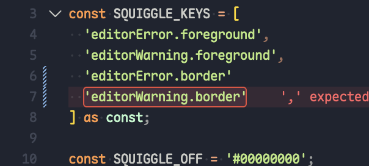

# Error Boxxy

VS Code squiggles are a dare: find the red worm in 400 lines of dark theme. **Error Boxxy** puts a real box around the broken token instead. Old-school highlight energy. If you grew up on Sublime / TextMate outlines, this is that itch.

## Settings

| Setting | Default | What it does |
| --- | --- | --- |
| `errorBoxxy.hideSquiggles` | `true` | Hide the native squiggles (`workbench.colorCustomizations`) |
| `errorBoxxy.errorBorder` | `1px solid #e74c3c` | Error box border |
| `errorBoxxy.errorBackground` | `rgba(255, 100, 135, 0.09)` | Error box fill |
| `errorBoxxy.warningBorder` | `1px solid #ffcf70a8` | Warning box border |
| `errorBoxxy.warningBackground` | `rgba(255, 155, 0, 0.09)` | Warning box fill |

## Commands

- `Error Boxxy: Hide Default Squiggles`
- `Error Boxxy: Restore Default Squiggles`

## License

MIT. See [LICENSE](LICENSE).
